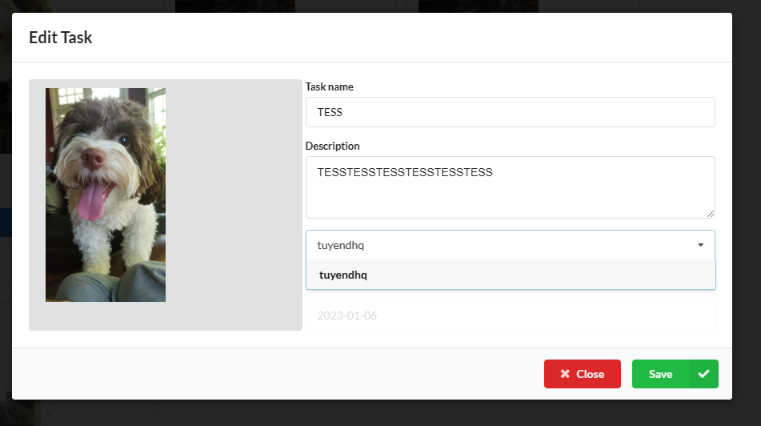

# Capstone Project

# Login - User Manager

1. After First Login, user must input infor and avatar:

2. User can edit info and avatar after create:

# Task manager
1. Each user can create task

2. User can assing/delegate task to other user in project

3. If task is nolong need, user can delete